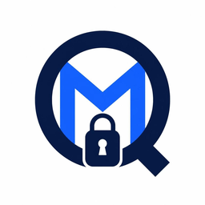

[](https://github.com/cathode-ray-tube/moq-secure/actions/workflows/test-js.yml)
[](https://github.com/cathode-ray-tube/moq-secure/actions/workflows/test-rust.yml)
[](https://github.com/cathode-ray-tube/moq-secure/actions/workflows/github-code-scanning/codeql)

[](https://crates.io/crates/moq-secure)
[](https://crates.io/crates/moq-secure)
[](https://docs.rs/moq-secure)

# MoQ-Secure Encryption & Signing

A fixed format for end-to-end secure **media payloads** carried by **Media over QUIC (MoQ)**.

Encryption algorithms:
- **ChaCha20-Poly1305**
- **AES-256-GCM**

Signature algorithm:
- **Ed25519**

> **Payload-Only Encryption:** MoQ is a content-agnostic transport format. MoQ-Secure encrypts only the frame’s media payload bytes. Transport framing and routing remain unchanged. **Metadata such as broadcast name, media codec and resolution remains unencrypted and visible to the relay.**

## Purpose

People increasingly want to protect their communications from pervasive monitoring and mass surveillance. At the same time, audiences need confidence that media is genuine: in an era of deepfakes, you often can’t tell whether a video or audio clip truly came from the person it claims to be.

MoQ-Secure is designed to provide:
- **Privacy** for the media payload - so content can’t be inspected in transit
- **Integrity** - so tampering is detected
- **Authenticity** - so frames can be verified as coming from a particular publisher
- **Flexibility** - balancing security and performance

Publishers are able to use **any** public MoQ CDN, with the hosting provider unable to see the content. Consumers can verify the publisher of the content, wherever they receive it from.

## Quick Start (`moq-secure-chat-cli`)

A terminal chat demo using MoQ with end-to-end encryption and Ed25519 message signing via [`moq-secure-chat`](https://github.com/cathode-ray-tube/moq-secure/tree/main/rs/examples/moq-secure-chat).

Install Rust and [moq-relay](https://github.com/moq-dev/moq/tree/main/rs/moq-relay), then start a local relay using the example configuration:

```bash
wget https://raw.githubusercontent.com/moq-dev/moq/refs/heads/main/demo/relay/localhost.toml
moq-relay localhost.toml
```

In another terminal, install and start the publisher:

```bash
cargo install moq-secure-chat-cli

moq-secure-chat-cli \
  --relay https://localhost:4443/chat \
  --tls-disable-verify \
  publish
```

The publisher generates the broadcast name and cryptographic keys, then prints a complete subscriber command. Copy that command into a third terminal and run it.

Type messages in the publisher terminal to send encrypted, signed chat messages.

The default encryption algorithm is ChaCha20-Poly1305. AES-256-GCM is also supported with:

```bash
--encryption aes-256-gcm
```

This is a demonstration application. For production use, harden key management, key distribution, authentication, and TLS configuration.

See the full [README.md](https://github.com/cathode-ray-tube/moq-secure/blob/main/rs/examples/moq-secure-chat-cli/README.md) for complete usage, configuration options, troubleshooting, and security notes.
## Quick Start (`moq-player`)


[](https://crates.io/crates/moq-player)
[](https://crates.io/crates/moq-player)

A native desktop player for MoQ audio/video streams using Rust, GTK4, and GStreamer.

> **MoQ-Secure is not integrated.** This version does not encrypt, decrypt, or verify media using MoQ-Secure.

See [instructions](https://github.com/cathode-ray-tube/moq-secure/blob/main/rs/examples/moq-player/README.md).

## Specification

The complete field layout, byte concatenation rules, nonce/AAD/digest definitions, and receiver processing order are in [specification](https://github.com/cathode-ray-tube/moq-secure/blob/main/specification/README.md).

Quick reference [format](https://github.com/cathode-ray-tube/moq-secure/blob/main/frame_format.txt).

## Interoperability

Only encrypts the payload so it should work with any MoQ implementation (moq-lite, IETF implementations, etc.).

While aimed at MoQ, with some additional wiring it could encrypt and sign data sent via other transports (such as WebSockets, WebRTC Data Channels, etc).

This repo contains implementations in [rust](https://github.com/cathode-ray-tube/moq-secure/tree/main/rs) and [javascript](https://github.com/cathode-ray-tube/moq-secure/tree/main/js). Compatability considerations between the two are in [interoperability](https://github.com/cathode-ray-tube/moq-secure/blob/main/interoperability/README.md).

## Tests 

Run **rust** tests, from monorepo root (script generates test vectors first, populating `frames.json` file in the `test-vectors` folder):

```bash
npm run test-rust
```

Run **javascript** tests, from monorepo root (script generates test vectors first, populating `frames.json` file in the `test-vectors` folder):

```bash
npm test
```

## License

This project is dual-licensed: MIT OR Apache-2.0, choose either. See LICENSE-MIT and LICENSE-APACHE-2.0 in the repository root.


